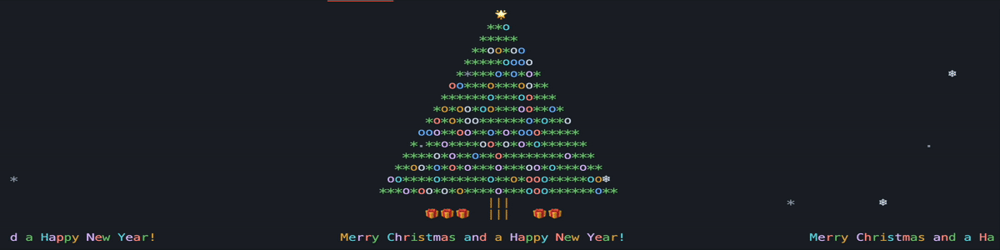

<div align="center">

# 🎄 Holidays 🎄

### *Spreading Joy and Festive Cheer Throughout the Year!* ✨


</div>

---

## Welcome to the Holiday Celebration Hub!

This **vibrant** repository is a collection of holiday-themed projects celebrating special occasions throughout the year! From New Year's to Halloween, from Easter to Diwali, and everything in between—discover projects that bring festive joy to your code all year long.

## 🎁 What's Inside?

This repository is your **one-stop destination** for holiday-themed projects celebrating occasions throughout the year:

- 🎉 **New Year Projects** - Ring in the new year with special celebrations
- 💝 **Valentine's Day** - Share the love with romantic themed projects
- 🎃 **Halloween Specials** - Spooky and fun October festivities
- 🎄 **Christmas & Winter Holidays** - Celebrate the festive season
- 🕯️ **Cultural Celebrations** - Projects for Diwali, Hanukkah, Eid, and more
- 🌸 **Seasonal Festivities** - Easter, Thanksgiving, and other seasonal celebrations

## 🌟 Features

- ✨ **Festive Themes** - Beautiful holiday-inspired designs
- 🎅 **Seasonal Content** - Projects updated for different celebrations
- 🎁 **Gift-Wrapped Code** - Clean, well-documented, and ready to use
- ❄️ **Community Driven** - Open to contributions from holiday enthusiasts

## 🎊 Getting Started

```bash
# Clone this festive repository
git clone https://github.com/vukasinterzic/Holidays.git

# Navigate to the holiday wonderland
cd Holidays

# Start spreading holiday cheer! 🎉
```

## 🤶 Contributing

We welcome contributions from everyone who loves holidays! Feel free to:

- 🌟 Add new holiday-themed projects
- 🎄 Improve existing celebrations
- ❄️ Fix bugs (even Santa makes mistakes!)
- 🎁 Share your festive ideas

## 📜 License

This project is licensed under the terms specified in the [LICENSE](LICENSE) file.

---

<div align="center">

### 🎊 Celebrate Every Occasion! 🎊

*May your code bring joy throughout the year!* ✨

</div>

---

### Project 1: Christmass Tree 2026

Displays a festive terminal animation with a Christmas tree, ornaments, falling snow, and a scrolling greeting.



### Project 2: New Year Countdown with Fireworks 2026

Features a colorful countdown to New Year 2026 with rotating colors, then displays Happy New Year 2026 in big ASCII text, followed by an infinite fireworks animation with sparkling effects.


### Project 3: Valentine's Day Animation 2026

A multi-phase Valentine's Day terminal animation featuring Cupid's arrow flying across the screen, a heart that assembles radially from the impact point, a personal name and message reveal with a heartbeat pulse effect, and a heart rain finale with a framed scrolling love banner.

```powershell
# Run the animation (you'll be prompted for a name and message)
pwsh -File Show-ValentineAnimation2026.ps1

# Or pass them directly
pwsh -File Show-ValentineAnimation2026.ps1 -Name "Alice" -Message "I love you!"
```

